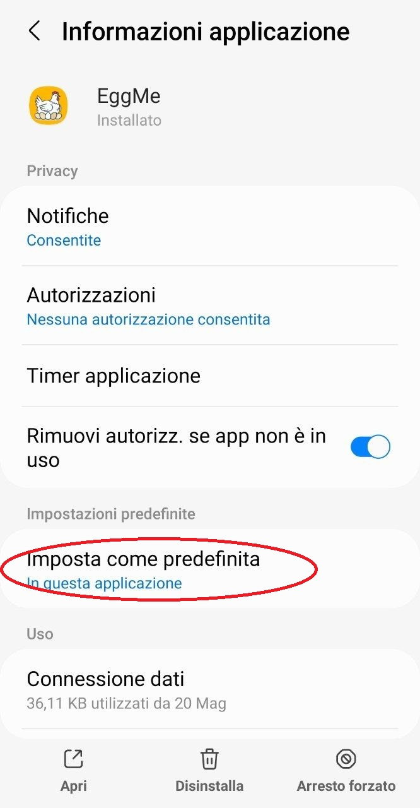
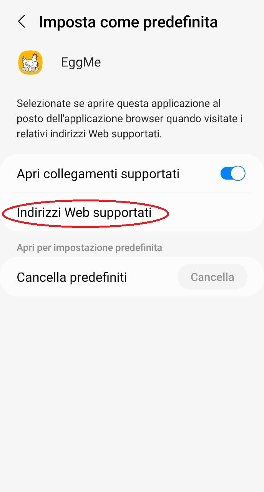
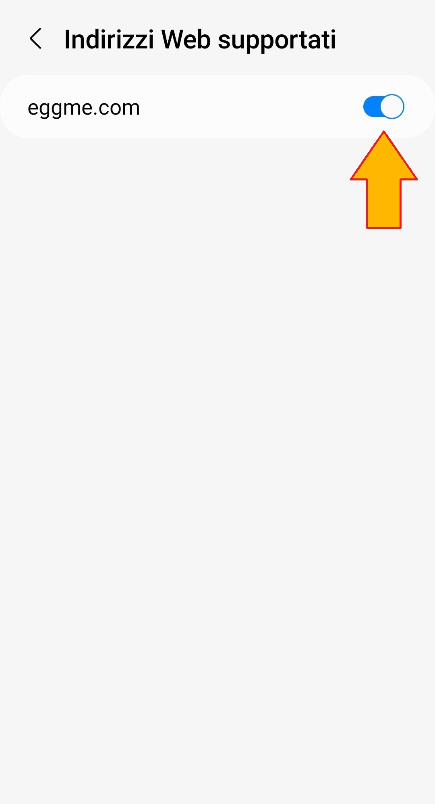

[](https://classroom.github.com/a/KXBBwjYj)


**FINAL ASSIGNMENT - GROUP 09**

# Welcome to EggMe!

A mobile application designed to connect food lovers through vegetarian, egg-centric recipes while fostering a community dedicated to sustainable and ethical farming.

## Documents

- **APK file**: The APK file is too big to be uploaded as a normal file on GitHub. You can find it in the attachments of the release commit
- **Video**: [appVideo.mp4](https://github.com/polito-mad-2026/project-assignment-final-odd-g09/blob/main/appVideo.mp4)
- **Presentation slides**: [EggMePresentation.pdf](https://github.com/polito-mad-2026/project-assignment-final-odd-g09/blob/main/EggMePresentation.pdf)


## Before start

### Insert google maps api key

When running in build mode:

Please write ```MAPS_API_KEY="yourkey"``` in the file ```MyApplication\local.properties```.

### Allow EggMe to open "eggme.com" links

Both when running in build mode or using release apk:

Please follow this three steps:

- Go to App information and click on "Set as predefined":



- Then select "Supported web link":



- And flag eggme.com link:



